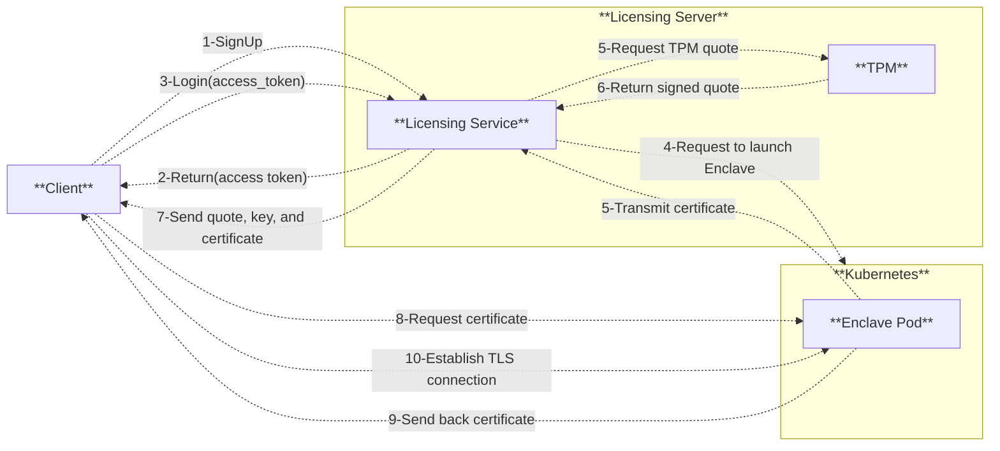
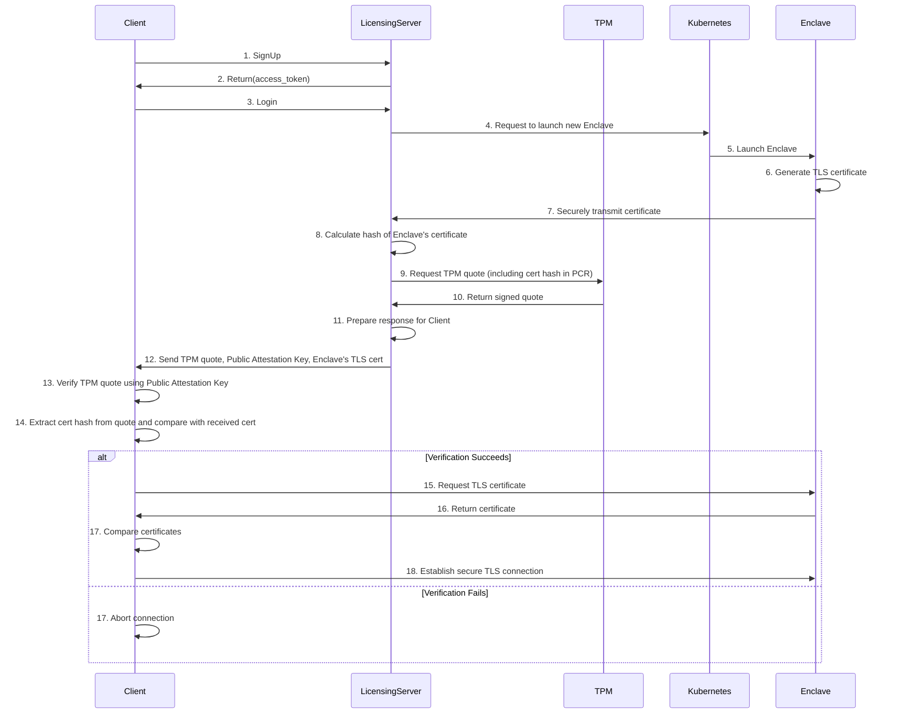

# Secure Licensing Server
## Table of Contents
- [Context](#context)

## Context
The objective is to construct a licensing server that will enable users to authenticate to enclaves (secure computational environments).
To achieve this, it will be necessary to consider a number of design patterns that must be implemented. 
The licensing server will be required to authenticate users to the enclave using a PKI infrastructure. 
The ideal scenario would be to authenticate users via username and password, with the licensing server verifying credentials and initiating an instance of an enclave that can be accessed using a PKI scheme.

## Architecture
This section defines an architecture presenting a solution to the problem, and by defining the steps that we will take to develop and deploy the architecture. The following points are important to consider:

* The cryptographic algorithms and mechanisms for implementing the PKI architecture and the prior authentication with details.
* The licensing server must include the hash of the enclave’s TLS certificate within its TPM quote. 
* The licensing server must return the quote and its public attestation key to the client to verify the quote and compare the enclave’s certificate against the hash contained in the quote.
* The possible usage of a Kubernetes architecture must be taken into account (what and how should it be deployed to enable the licensing server to launch enclaves automatically at user’s request). 

## Implementation
Try to implement the architecture precedently defined (in a docker container with your preferred language) with gRPC. 
The following requirements must be taken into account:
* It is intended to be a container that runs in a Kubernetes node
* Extend the implementation by explaining, in a paragraph or more (and with drawings if necessary), the security changes that should be made to safely provision new keys, handle the authentication and establish a communication channel from the user to the enclave. 
* You can make the assumption that the enclave could be accessible through an IP address or a domain but the client must verify that the TLS certificate provided by the enclave matches the certificate included in the quote from the licensing server before connecting to the enclave. 

## Architecture

## Sequence Diagram
This section describes the sequences diagram of `Authentication`service:
