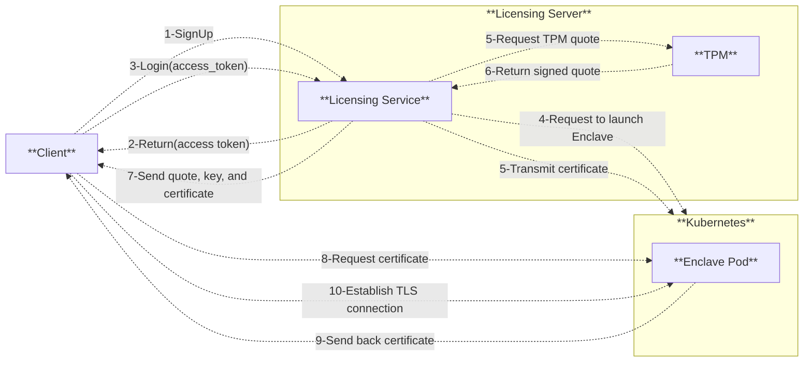
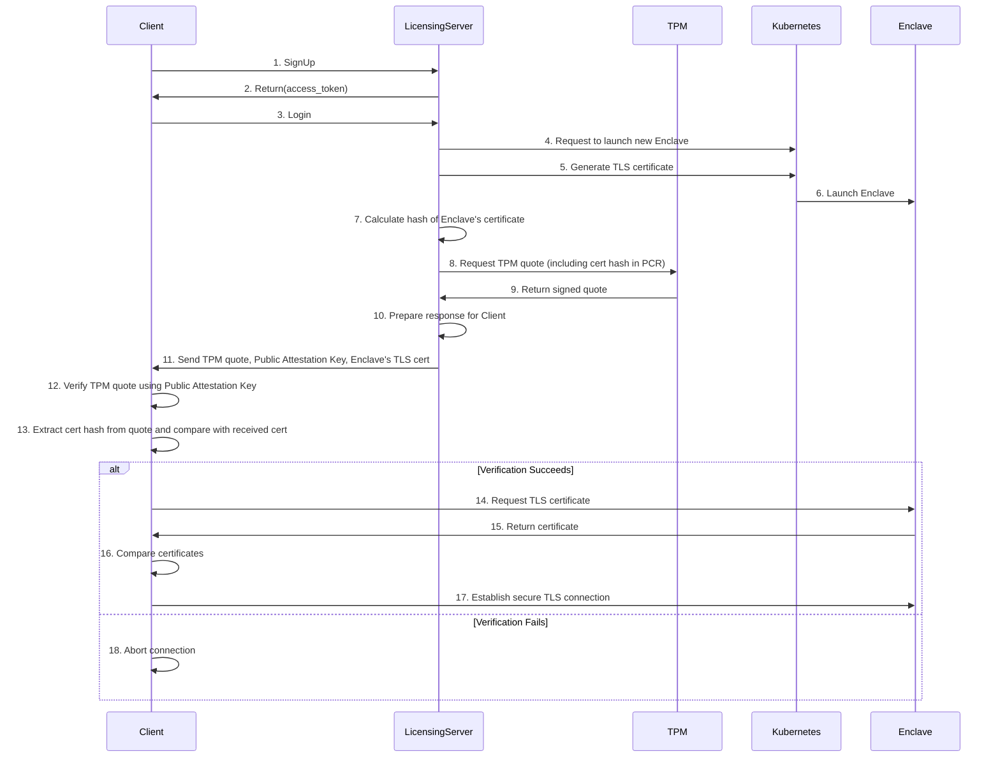
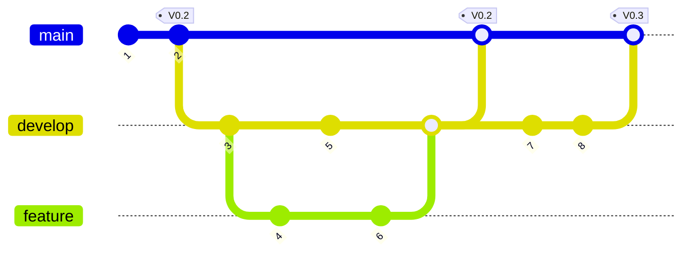

# Secure Licensing Server
## Table of Contents
- [Secure Licensing Server](#secure-licensing-server)
  - [Table of Contents](#table-of-contents)
  - [Context](#context)
  - [Architecture](#architecture)
  - [Implementation](#implementation)
  - [Technical Aspects](#technical-aspects)
    - [Trusted Platform Module (TPM)](#trusted-platform-module-tpm)
      - [TPM Quote](#tpm-quote)
        - [Attestation Key (AK)](#attestation-key-ak)
    - [TPM quote usage in our usecase](#tpm-quote-usage-in-our-usecase)
    - [How to leverage TPM in container (on Kubernetes)](#how-to-leverage-tpm-in-container-on-kubernetes)
      - [TPM DaemonSet:](#tpm-daemonset)
      - [Direct TPM Access:](#direct-tpm-access)
  - [Architecture](#architecture-1)
  - [Sequence Diagram](#sequence-diagram)
- [Technical Environnement](#technical-environnement)
    - [System Requirements](#system-requirements)
  - [Stack Deployment](#stack-deployment)
  - [Docker Compose](#docker-compose)
  - [Kubernetes](#kubernetes)
  - [Application Security](#application-security)
    - [Code Quality](#code-quality)
    - [Image Security](#image-security)
    - [Software Composition Analysis](#software-composition-analysis)
    - [Static Application Security Testing (SAST)](#static-application-security-testing-sast)
  - [Best Practice](#best-practice)
    - [WorkFlow Git](#workflow-git)
    - [IDE](#ide)
      - [Extensions:](#extensions)

## Context
The objective is to construct a licensing server that will enable users to authenticate to enclaves (secure computational environments).
To achieve this, it will be necessary to consider a number of design patterns that must be implemented. 
The licensing server will be required to authenticate users to the enclave using a PKI infrastructure. 
The ideal scenario would be to authenticate users via username and password, with the licensing server verifying credentials and initiating an instance of an enclave that can be accessed using a PKI scheme.

## Architecture
This section defines an architecture presenting a solution to the problem, and by defining the steps that we will take to develop and deploy the architecture. The following points are important to consider:

* The cryptographic algorithms and mechanisms for implementing the PKI architecture and the prior authentication with details.
* The licensing server must include the hash of the enclave’s TLS certificate within its TPM quote. 
* The licensing server must return the quote and its public attestation key to the client to verify the quote and compare the enclave’s certificate against the hash contained in the quote.
* The possible usage of a Kubernetes architecture is taken into account (what and how should it be deployed to enable the licensing server to launch enclaves automatically at user’s request). 

## Implementation
We implement the architecture precedently defined in a docker container, in Python with gRPC. 
The following requirements must be taken into account:
* It is intended to be a container that runs in a Kubernetes node
* Extend the implementation by explaining, in a paragraph or more (and with drawings if necessary), the security changes that should be made to safely provision new keys, handle the authentication and establish a communication channel from the user to the enclave. 
* You can make the assumption that the enclave could be accessible through an IP address or a domain but the client must verify that the TLS certificate provided by the enclave matches the certificate included in the quote from the licensing server before connecting to the enclave. 

## Technical Aspects
### Trusted Platform Module (TPM)
The Trusted Platform Module (TPM) is a specialised hardware security chip designed to provide enhanced security features for computing devices. It is typically implemented as a small chip integrated into a device's motherboard or processor. The primary objective of TPM is to guarantee the integrity of the platform and provide a secure environment for cryptographic operations.

Key features and functions of TPM include:
1. Cryptographic key generation and storage
2. Secure boot process verification
3. Data encryption and decryption
4. Device authentication
5. Protection against tampering and malicious software

#### TPM Quote
The TPM quote is a cryptographic operation performed by the TPM to provide attestation of the system's integrity.

This quote includes:
1. The current PCR values (Special registers in the TPM)
2. A nonce (to prevent replay attacks)
3. The signature created using a key stored (attestation key) in the TPM

##### Attestation Key (AK)
The Attestation Key is a special key generated and protected by the TPM. It is an asymmetric key pair (public and private parts). The private part never leaves the TPM, ensuring its security. It is typically derived from the TPM's Endorsement Key.

    When a TPM quote is requested, the following process occurs:
    1. The TPM generates a quote containing the qualifying data.
    2. The quote is then signed using the private part of the Attestation Key.
    3. The resulting signature is attached to the quote data.
   
### TPM quote usage in our usecase
In our scenario the quote contains hash of TLS certificate and it's signature.

```json
TpmQuote {
    string tls_certificate_hash;
    bytes signature;
}
```
The quote will be sent back to the client with the following items:
1. Public attestation key
2. TLS certification

```json
EnclaveLaunchResponse {
    string enclave_name;
    string access_point;
    optional bytes tls_certificate;
    optional bytes public_attestation_key;
    optional TpmQuote tpm_quote;
}
```

The client can generate an enclave TLS certificate when it receives the payload. It can also verify the signature with the public attestation key that is in the payload.


### How to leverage TPM in container (on Kubernetes)
There are two main approaches for utilizing TPM 2.0 capabilities in containers running on Kubernetes:
#### TPM DaemonSet:
The method entails the deployment of a DaemonSet, which makes TPM functionality available to containers via a gRPC service.

* A privileged DaemonSet pod runs on each node (of Kubernetes) with access to the host's TPM device (`/dev/tpm0`)
    It exposes common TPM operations like key generation, signing, attestation etc. through a gRPC API.
* Other containers can then access TPM functionality by making gRPC calls to the DaemonSet service, without needing direct TPM access.

```
The DaemonSet method is generally considered as a more secure and Kubernetes-native solution.
```
#### Direct TPM Access:
This method provides containers with direct access to the TPM device.

* The container is granted access to `/dev/tpm0` through a volume mount. TPM tools and libraries like tpm2-tools are installed in the container image. The container can then directly interact with the TPM using these tools.

```
Note: We did not utilise TPM in our scenario as the laptop in question does not have TPM functionality. We assume that the attestation keys are stored in the TPM.
```

## Architecture


## Sequence Diagram
This section describes the sequences diagram of `Authentication`service:

# Technical Environnement
The table below shows the tools and solutions used in the project:

| Item    | Technology/ Tool | Version |
| -------- | ------- | ------- |
| Programming Lanaguage  | Python    | 3.8 |
| DataBase | Postgresql     | 13 |
| Container    | Docker   | 24.0.07 |
| VCS           | GitHub | N/A|
| Container Deployment           | Docker-compose   | 2.29.7|
| Container Deployment | MiniKube |  1.34.0 |

### System Requirements
* Recommended system requirements: 1GB RAM, x86 or arm64 CPU
* Minimum system requirements: 512MB RAM + swap

## Stack Deployment
The application stack can be run using:
1. Docker Compose.
2. Using Kubernetes (Minikube)

## Docker Compose
Docker Compose is an easy way to run the stack on a standalone machine.

* Install Docker and Docker Compose. For example, on Debian/Ubuntu `sudo apt-get install docker-compose docker.io`
* Copy `docker-compose.yml` to your machine.
* Edit the environment section of `docker-compose.yml`. See the Configuration section below.
* Finally, start docker containers using `docker-compose up -d`. 

**Important ENV variables are:**
| Variable    | Description | Value |
| -------- | ------- | ------- |
| POSTGRES_DB | name of DB | userdb |
| POSTGRES_PASSWORD | password of DB instance | postgres |
| DATABASE_USER | DB user which is used in services | POSTGRES_USER |
| DATABASE_HOST | IP of DB | localhost |

## Kubernetes
For deployment on a Kubernetes cluster, there are all necessary files to deploy the stack:

```
├── dep-auth.yaml
├── dep-postgres.yaml
├── dep-enclave.yaml
├── lb-auth.yaml
└── lb-enclave.yaml
```

Here is the command to deploy full stack:
```bash
kubectl apply -f dep-postgres.yaml,dep-auth.yaml,dep-postgres.yaml,dep-enclave.yaml,lb-auth.yaml,lb-enclave.yaml
```

**`Note: the order of deployment is very important`**

After a successfull deployment, we can see:
```console
user@vm:/secure_license_server/k8s-files$ kubectl get deploy
NAME                           READY   UP-TO-DATE   AVAILABLE   AGE
cn_auth                        1/1     1            1           50m
cn-postgres                    1/1     1            1           50m
cn-enclave                     1/1     1            1           50m
```

To get access to the application from an external network(outside of Kubernetes), and in case of using **Minikube**, we need to perform some additional steps:

1)
```bash
~$ minikube tunnel
```
then run the following command, which give us the external IP and port to get access to the services:

2)
```bash
~$ minikube service -n tpm lb-auth
|-----------|-------------------------|-------------|-----------------------------|
| NAMESPACE |          NAME           | TARGET PORT |             URL             |
|-----------|-------------------------|-------------|-----------------------------|
| tpm       | lb-auth                 |       45000 | http://192.168.50.109:30241 |
|-----------|-------------------------|-------------|-----------------------------|
```

## Application Security
### Code Quality
Code quality is an important factor in the software development life cycle (SDLC) due to its direct impact on the reliability, stability and maintainability of the software. Ensuring code quality is paramount to guaranteeing software that functions optimally over time, minimising the time spent on bug fixes and technical debt.
Tools such as Sonarlint can be employed to enhance code quality from the early stages of development. In this project, Sonarlint and Pylint are utilised within the Visual Studio Code integrated development environment (IDE).

### Image Security
Docker images are scanned by [Trivy](https://trivy.dev/) to identifiy any security vulnerability:
`sudo trivy image img-auth`

```
Total: 128 (UNKNOWN: 0, LOW: 79, MEDIUM: 35, HIGH: 12, CRITICAL: 2)

┌────────────────────┬─────────────────────┬──────────┬──────────────┬─────────────────────────┬──────────────────┬──────────────────────────────────────────────────────────────┐
│      Library       │    Vulnerability    │ Severity │    Status    │    Installed Version    │  Fixed Version   │                            Title                             │
├────────────────────┼─────────────────────┼──────────┼──────────────┼─────────────────────────┼──────────────────┼──────────────────────────────────────────────────────────────┤
│ apt                │ CVE-2011-3374       │ LOW      │ affected     │ 2.2.4                   │                  │ It was found that apt-key in apt, all versions, do not       │
│                    │                     │          │              │                         │                  │ correctly...                                                 │
│                    │                     │          │              │                         │                  │ https://avd.aquasec.com/nvd/cve-2011-3374                    │
├────────────────────┼─────────────────────┼──────────┤              ├─────────────────────────┼──────────────────┼──────────────────────────────────────────────────────────────┤
│ bash               │ CVE-2022-3715       │ HIGH     │              │ 5.1-2+deb11u1           │                  │ bash: a heap-buffer-overflow in valid_parameter_transform    │
│                    │                     │          │              │                         │                  │ https://avd.aquasec.com/nvd/cve-2022-3715                    │
│                    ├─────────────────────┼──────────┤              │                         ├──────────────────┼──────────────────────────────────────────────────────────────┤
│                    │ TEMP-0841856-B18BAF │ LOW      │              │                         │                  │ [Privilege escalation possible to other user than root]      │
│                    │                     │          │              │                         │                  │ https://security-tracker.debian.org/tracker/TEMP-0841856-B1- │
│                    │                     │          │              │                         │                  │ 8BAF                                                         │
├────────────────────┼─────────────────────┤          │              ├─────────────────────────┼──────────────────┼──────────────────────────────────────────────────────────────┤
│ bsdutils           │ CVE-2022-0563       │          │              │ 1:2.36.1-8+deb11u2      │                  │ util-linux: partial disclosure of arbitrary files in chfn    │
│                    │                     │          │              │                         │                  │ and chsh when compiled...                                    │
│                    │                     │          │              │                         │                  │ https://avd.aquasec.com/nvd/cve-2022-0563                    │
├────────────────────┼─────────────────────┤          ├──────────────┼─────────────────────────┼──────────────────┼──────────────────────────────────────────────────────────────┤
│ coreutils          │ CVE-2016-2781       │          │ will_not_fix │ 8.32-4+b1               │                  │ coreutils: Non-privileged session can escape to the parent   │
│                    │                     │          │              │                         │                  │ session in chroot                                            │
│                    │                     │          │              │                         │                  │ https://avd.aquasec.com/nvd/cve-2016-2781                    │
│                    ├─────────────────────┤          ├──────────────┤                         ├──────────────────┼──────────────────────────────────────────────────────────────┤
│                    │ CVE-2017-18018      │          │ affected     │                         │                  │ coreutils: race condition vulnerability in chown and chgrp   │
│                    │                     │          │              │                         │                  │ https://avd.aquasec.com/nvd/cve-2017-18018                   │
├────────────────────┼─────────────────────┼──────────┼──────────────┼─────────────────────────┼──────────────────┼──────────────────────────────────────────────────────────────┤
│ e2fsprogs          │ CVE-2022-1304       │ HIGH     │ fixed        │ 1.46.2-2                │ 1.46.2-2+deb11u1 │ e2fsprogs: out-of-bounds read/write via crafted filesystem   │
│                    │                     │          │              │                         │                  │ https://avd.aquasec.com/nvd/cve-2022-1304                    │
├────────────────────┼─────────────────────┼──────────┼──────────────┼─────────────────────────┼──────────────────┼──────────────────────────────────────────────────────────────┤
│ gcc-10-base        │ CVE-2023-4039       │ MEDIUM   │ affected     │ 10.2.1-6                │                  │ gcc: -fstack-protector fails to guard dynamic stack          │
│                    │                     │          │              │                         │                  │ allocations on ARM64                                         │
│                    │                     │          │              │                         │                  │ https://avd.aquasec.com/nvd/cve-2023-4039                    │
├────────────────────┤                     │          │              ├─────────────────────────┼──────────────────┤                                                              │
│ gcc-9-base         │                     │          │              │ 9.3.0-22                │                  │                                                              │
│                    │                     │          │              │                         │                  │                                                              │
│                    │                     │          │              │                         │                  │                                                              │
├────────────────────┼─────────────────────┼──────────┤              ├─────────────────────────┼──────────────────┼──────────────────────────────────────────────────────────────┤
│ gpgv               │ CVE-2022-3219       │ LOW      │              │ 2.2.27-2+deb11u2        │                  │ gnupg: denial of service issue (resource consumption) using  │
│                    │                     │          │              │                         │                  │ compressed packets                                           │
│                    │                     │          │              │                         │                  │ https://avd.aquasec.com/nvd/cve-2022-3219                    │
├────────────────────┼─────────────────────┤          │              ├─────────────────────────┼──────────────────┼──────────────────────────────────────────────────────────────┤
│ libapt-pkg6.0      │ CVE-2011-3374       │          │              │ 2.2.4                   │                  │ It was found that apt-key in apt, all versions, do not       │
│                    │                     │          │              │                         │                  │ correctly...                                                 │
│                    │                     │          │              │                         │                  │ https://avd.aquasec.com/nvd/cve-2011-3374                    │
├────────────────────┼─────────────────────┤          │              ├─────────────────────────┼──────────────────┼──────────────────────────────────────────────────────────────┤
│ libblkid1          │ CVE-2022-0563       │          │              │ 2.36.1-8+deb11u2        │                  │ util-linux: partial disclosure of arbitrary files in chfn    │
│                    │                     │          │              │                         │                  │ and chsh when compiled...                                    │
│                    │                     │          │              │                         │                  │ https://avd.aquasec.com/nvd/cve-2022-0563                    │
├────────────────────┼─────────────────────┼──────────┤              ├─────────────────────────┼──────────────────┼──────────────────────────────────────────────────────────────┤
│ libc-bin           │ CVE-2023-4806       │ MEDIUM   │              │ 2.31-13+deb11u11        │                  │ glibc: potential use-after-free in getaddrinfo()             │
│                    │                     │          │              │                         │                  │ https://avd.aquasec.com/nvd/cve-2023-4806                    │
│                    ├─────────────────────┤          │              │                         ├──────────────────┼──────────────────────────────────────────────────────────────┤
│                    │ CVE-2023-4813       │          │              │                         │                  │ glibc: potential use-after-free in gaih_inet()               │
│                    │                     │          │              │                         │                  │ https://avd.aquasec.com/nvd/cve-2023-4813                    │
│                    ├─────────────────────┼──────────┤              │                         ├──────────────────┼──────────────────────────────────────────────────────────────┤
│                    │ CVE-2010-4756       │ LOW      │              │                         │                  │ glibc: glob implementation can cause excessive CPU and       │
│                    │                     │          │              │                         │                  │ memory consumption due to...                                 │
│                    │                     │          │              │                         │                  │ https://avd.aquasec.com/nvd/cve-2010-4756                    │
│                    ├─────────────────────┤          │              │                         ├──────────────────┼──────────────────────────────────────────────────────────────┤
│                    │ CVE-2018-20796      │          │              │                         │                  │ glibc: uncontrolled recursion in function                    │
│                    │                     │          │              │                         │                  │ check_dst_limits_calc_pos_1 in posix/regexec.c               │
│                    │                     │          │              │                         │                  │ https://avd.aquasec.com/nvd/cve-2018-20796                   │
│                    ├─────────────────────┤          │              │                         ├──────────────────┼──────────────────────────────────────────────────────────────┤
│                    │ CVE-2019-1010022    │          │              │                         │                  │ glibc: stack guard protection bypass                         │
│                    │                     │          │              │                         │                  │ https://avd.aquasec.com/nvd/cve-2019-1010022                 │
│                    ├─────────────────────┤          │              │                         ├──────────────────┼──────────────────────────────────────────────────────────────┤
│                    │ CVE-2019-1010023    │          │              │                         │                  │ glibc: running ldd on malicious ELF leads to code execution  │
│                    │                     │          │              │                         │                  │ because of...                                                │
│                    │                     │          │              │                         │                  │ https://avd.aquasec.com/nvd/cve-2019-1010023                 │
│                    ├─────────────────────┤          │              │                         ├──────────────────┼──────────────────────────────────────────────────────────────┤
│                    │ CVE-2019-1010024    │          │              │                         │                  │ glibc: ASLR bypass using cache of thread stack and heap      │
│                    │                     │          │              │                         │                  │ https://avd.aquasec.com/nvd/cve-2019-1010024                 │
│                    ├─────────────────────┤          │              │                         ├──────────────────┼──────────────────────────────────────────────────────────────┤
│                    │ CVE-2019-1010025    │          │              │                         │                  │ glibc: information disclosure of heap addresses of           │
│                    │                     │          │              │                         │                  │ pthread_created thread                                       │
│                    │                     │          │              │                         │                  │ https://avd.aquasec.com/nvd/cve-2019-1010025                 │
│                    ├─────────────────────┤          │              │                         ├──────────────────┼──────────────────────────────────────────────────────────────┤
│                    │ CVE-2019-9192       │          │              │                         │                  │ glibc: uncontrolled recursion in function                    │
│                    │                     │          │              │                         │                  │ check_dst_limits_calc_pos_1 in posix/regexec.c               │
│                    │                     │          │              │                         │                  │ https://avd.aquasec.com/nvd/cve-2019-9192                    │
├────────────────────┼─────────────────────┼──────────┤              │                         ├──────────────────┼──────────────────────────────────────────────────────────────┤
│ libc6              │ CVE-2023-4806       │ MEDIUM   │              │                         │                  │ glibc: potential use-after-free in getaddrinfo()             │
│                    │                     │          │              │                         │                  │ https://avd.aquasec.com/nvd/cve-2023-4806                    │
│                    ├─────────────────────┤          │              │                         ├──────────────────┼──────────────────────────────────────────────────────────────┤
│                    │ CVE-2023-4813       │          │              │                         │                  │ glibc: potential use-after-free in gaih_inet()               │
│                    │                     │          │              │                         │                  │ https://avd.aquasec.com/nvd/cve-2023-4813                    │
│                    ├─────────────────────┼──────────┤              │                         ├──────────────────┼──────────────────────────────────────────────────────────────┤
│                    │ CVE-2010-4756       │ LOW      │              │                         │                  │ glibc: glob implementation can cause excessive CPU and       │
│                    │                     │          │              │                         │                  │ memory consumption due to...                                 │
│                    │                     │          │              │                         │                  │ https://avd.aquasec.com/nvd/cve-2010-4756                    │
│                    ├─────────────────────┤          │              │                         ├──────────────────┼──────────────────────────────────────────────────────────────┤
│                    │ CVE-2018-20796      │          │              │                         │                  │ glibc: uncontrolled recursion in function                    │
│                    │                     │          │              │                         │                  │ check_dst_limits_calc_pos_1 in posix/regexec.c               │
│                    │                     │          │              │                         │                  │ https://avd.aquasec.com/nvd/cve-2018-20796                   │
│                    ├─────────────────────┤          │              │                         ├──────────────────┼──────────────────────────────────────────────────────────────┤
│                    │ CVE-2019-1010022    │          │              │                         │                  │ glibc: stack guard protection bypass                         │
│                    │                     │          │              │                         │                  │ https://avd.aquasec.com/nvd/cve-2019-1010022                 │
│                    ├─────────────────────┤          │              │                         ├──────────────────┼──────────────────────────────────────────────────────────────┤
│                    │ CVE-2019-1010023    │          │              │                         │                  │ glibc: running ldd on malicious ELF leads to code execution  │
│                    │                     │          │              │                         │                  │ because of...                                                │
│                    │                     │          │              │                         │                  │ https://avd.aquasec.com/nvd/cve-2019-1010023                 │
│                    ├─────────────────────┤          │              │                         ├──────────────────┼──────────────────────────────────────────────────────────────┤
│                    │ CVE-2019-1010024    │          │              │                         │                  │ glibc: ASLR bypass using cache of thread stack and heap      │
│                    │                     │          │              │                         │                  │ https://avd.aquasec.com/nvd/cve-2019-1010024                 │
│                    ├─────────────────────┤          │              │                         ├──────────────────┼──────────────────────────────────────────────────────────────┤
│                    │ CVE-2019-1010025    │          │              │                         │                  │ glibc: information disclosure of heap addresses of           │
│                    │                     │          │              │                         │                  │ pthread_created thread                                       │
│                    │                     │          │              │                         │                  │ https://avd.aquasec.com/nvd/cve-2019-1010025                 │
│                    ├─────────────────────┤          │              │                         ├──────────────────┼──────────────────────────────────────────────────────────────┤
│                    │ CVE-2019-9192       │          │              │                         │                  │ glibc: uncontrolled recursion in function                    │
│                    │                     │          │              │                         │                  │ check_dst_limits_calc_pos_1 in posix/regexec.c               │
│                    │                     │          │              │                         │                  │ https://avd.aquasec.com/nvd/cve-2019-9192                    │
├────────────────────┼─────────────────────┼──────────┼──────────────┼─────────────────────────┼──────────────────┼──────────────────────────────────────────────────────────────┤
│ libcom-err2        │ CVE-2022-1304       │ HIGH     │ fixed        │ 1.46.2-2                │ 1.46.2-2+deb11u1 │ e2fsprogs: out-of-bounds read/write via crafted filesystem   │
│                    │                     │          │              │                         │                  │ https://avd.aquasec.com/nvd/cve-2022-1304                    │
├────────────────────┼─────────────────────┼──────────┼──────────────┼─────────────────────────┼──────────────────┼──────────────────────────────────────────────────────────────┤
│ libdb5.3           │ CVE-2019-8457       │ CRITICAL │ will_not_fix │ 5.3.28+dfsg1-0.8        │                  │ sqlite: heap out-of-bound read in function rtreenode()       │
│                    │                     │          │              │                         │                  │ https://avd.aquasec.com/nvd/cve-2019-8457                    │
├────────────────────┼─────────────────────┼──────────┼──────────────┼─────────────────────────┼──────────────────┼──────────────────────────────────────────────────────────────┤
│ libexpat1          │ CVE-2013-0340       │ LOW      │ affected     │ 2.2.10-2+deb11u6        │                  │ expat: internal entity expansion                             │
│                    │                     │          │              │                         │                  │ https://avd.aquasec.com/nvd/cve-2013-0340                    │
│                    ├─────────────────────┤          │              │                         ├──────────────────┼──────────────────────────────────────────────────────────────┤
│                    │ CVE-2023-52426      │          │              │                         │                  │ expat: recursive XML entity expansion vulnerability          │
│                    │                     │          │              │                         │                  │ https://avd.aquasec.com/nvd/cve-2023-52426                   │
│                    ├─────────────────────┤          │              │                         ├──────────────────┼──────────────────────────────────────────────────────────────┤
│                    │ CVE-2024-28757      │          │              │                         │                  │ expat: XML Entity Expansion                                  │
│                    │                     │          │              │                         │                  │ https://avd.aquasec.com/nvd/cve-2024-28757                   │
├────────────────────┼─────────────────────┼──────────┼──────────────┼─────────────────────────┼──────────────────┼──────────────────────────────────────────────────────────────┤
│ libext2fs2         │ CVE-2022-1304       │ HIGH     │ fixed        │ 1.46.2-2                │ 1.46.2-2+deb11u1 │ e2fsprogs: out-of-bounds read/write via crafted filesystem   │
│                    │                     │          │              │                         │                  │ https://avd.aquasec.com/nvd/cve-2022-1304                    │
├────────────────────┼─────────────────────┼──────────┼──────────────┼─────────────────────────┼──────────────────┼──────────────────────────────────────────────────────────────┤
│ libgcc-s1          │ CVE-2023-4039       │ MEDIUM   │ affected     │ 10.2.1-6                │                  │ gcc: -fstack-protector fails to guard dynamic stack          │
│                    │                     │          │              │                         │                  │ allocations on ARM64                                         │
│                    │                     │          │              │                         │                  │ https://avd.aquasec.com/nvd/cve-2023-4039                    │
├────────────────────┼─────────────────────┼──────────┤              ├─────────────────────────┼──────────────────┼──────────────────────────────────────────────────────────────┤
│ libgcrypt20        │ CVE-2021-33560      │ HIGH     │              │ 1.8.7-6                 │                  │ libgcrypt: mishandles ElGamal encryption because it lacks    │
│                    │                     │          │              │                         │                  │ exponent blinding to address a...                            │
│                    │                     │          │              │                         │                  │ https://avd.aquasec.com/nvd/cve-2021-33560                   │
│                    ├─────────────────────┼──────────┤              │                         ├──────────────────┼──────────────────────────────────────────────────────────────┤
│                    │ CVE-2024-2236       │ MEDIUM   │              │                         │                  │ libgcrypt: vulnerable to Marvin Attack                       │
│                    │                     │          │              │                         │                  │ https://avd.aquasec.com/nvd/cve-2024-2236                    │
│                    ├─────────────────────┼──────────┤              │                         ├──────────────────┼──────────────────────────────────────────────────────────────┤
│                    │ CVE-2018-6829       │ LOW      │              │                         │                  │ libgcrypt: ElGamal implementation doesn't have semantic      │
│                    │                     │          │              │                         │                  │ security due to incorrectly encoded plaintexts...            │
│                    │                     │          │              │                         │                  │ https://avd.aquasec.com/nvd/cve-2018-6829                    │
├────────────────────┼─────────────────────┤          │              ├─────────────────────────┼──────────────────┼──────────────────────────────────────────────────────────────┤
│ libgnutls30        │ CVE-2011-3389       │          │              │ 3.7.1-5+deb11u6         │                  │ HTTPS: block-wise chosen-plaintext attack against SSL/TLS    │
│                    │                     │          │              │                         │                  │ (BEAST)                                                      │
│                    │                     │          │              │                         │                  │ https://avd.aquasec.com/nvd/cve-2011-3389                    │
├────────────────────┼─────────────────────┼──────────┤              ├─────────────────────────┼──────────────────┼──────────────────────────────────────────────────────────────┤
│ libgssapi-krb5-2   │ CVE-2024-26458      │ MEDIUM   │              │ 1.18.3-6+deb11u5        │                  │ krb5: Memory leak at /krb5/src/lib/rpc/pmap_rmt.c            │
│                    │                     │          │              │                         │                  │ https://avd.aquasec.com/nvd/cve-2024-26458                   │
│                    ├─────────────────────┤          │              │                         ├──────────────────┼──────────────────────────────────────────────────────────────┤
│                    │ CVE-2024-26461      │          │              │                         │                  │ krb5: Memory leak at /krb5/src/lib/gssapi/krb5/k5sealv3.c    │
│                    │                     │          │              │                         │                  │ https://avd.aquasec.com/nvd/cve-2024-26461                   │
│                    ├─────────────────────┼──────────┤              │                         ├──────────────────┼──────────────────────────────────────────────────────────────┤
│                    │ CVE-2018-5709       │ LOW      │              │                         │                  │ krb5: integer overflow in dbentry->n_key_data in             │
│                    │                     │          │              │                         │                  │ kadmin/dbutil/dump.c                                         │
│                    │                     │          │              │                         │                  │ https://avd.aquasec.com/nvd/cve-2018-5709                    │
├────────────────────┼─────────────────────┼──────────┤              │                         ├──────────────────┼──────────────────────────────────────────────────────────────┤
│ libk5crypto3       │ CVE-2024-26458      │ MEDIUM   │              │                         │                  │ krb5: Memory leak at /krb5/src/lib/rpc/pmap_rmt.c            │
│                    │                     │          │              │                         │                  │ https://avd.aquasec.com/nvd/cve-2024-26458                   │
│                    ├─────────────────────┤          │              │                         ├──────────────────┼──────────────────────────────────────────────────────────────┤
│                    │ CVE-2024-26461      │          │              │                         │                  │ krb5: Memory leak at /krb5/src/lib/gssapi/krb5/k5sealv3.c    │
│                    │                     │          │              │                         │                  │ https://avd.aquasec.com/nvd/cve-2024-26461                   │
│                    ├─────────────────────┼──────────┤              │                         ├──────────────────┼──────────────────────────────────────────────────────────────┤
│                    │ CVE-2018-5709       │ LOW      │              │                         │                  │ krb5: integer overflow in dbentry->n_key_data in             │
│                    │                     │          │              │                         │                  │ kadmin/dbutil/dump.c                                         │
│                    │                     │          │              │                         │                  │ https://avd.aquasec.com/nvd/cve-2018-5709                    │
├────────────────────┼─────────────────────┼──────────┤              │                         ├──────────────────┼──────────────────────────────────────────────────────────────┤
│ libkrb5-3          │ CVE-2024-26458      │ MEDIUM   │              │                         │                  │ krb5: Memory leak at /krb5/src/lib/rpc/pmap_rmt.c            │
│                    │                     │          │              │                         │                  │ https://avd.aquasec.com/nvd/cve-2024-26458                   │
│                    ├─────────────────────┤          │              │                         ├──────────────────┼──────────────────────────────────────────────────────────────┤
│                    │ CVE-2024-26461      │          │              │                         │                  │ krb5: Memory leak at /krb5/src/lib/gssapi/krb5/k5sealv3.c    │
│                    │                     │          │              │                         │                  │ https://avd.aquasec.com/nvd/cve-2024-26461                   │
│                    ├─────────────────────┼──────────┤              │                         ├──────────────────┼──────────────────────────────────────────────────────────────┤
│                    │ CVE-2018-5709       │ LOW      │              │                         │                  │ krb5: integer overflow in dbentry->n_key_data in             │
│                    │                     │          │              │                         │                  │ kadmin/dbutil/dump.c                                         │
│                    │                     │          │              │                         │                  │ https://avd.aquasec.com/nvd/cve-2018-5709                    │
├────────────────────┼─────────────────────┼──────────┤              │                         ├──────────────────┼──────────────────────────────────────────────────────────────┤
│ libkrb5support0    │ CVE-2024-26458      │ MEDIUM   │              │                         │                  │ krb5: Memory leak at /krb5/src/lib/rpc/pmap_rmt.c            │
│                    │                     │          │              │                         │                  │ https://avd.aquasec.com/nvd/cve-2024-26458                   │
│                    ├─────────────────────┤          │              │                         ├──────────────────┼──────────────────────────────────────────────────────────────┤
│                    │ CVE-2024-26461      │          │              │                         │                  │ krb5: Memory leak at /krb5/src/lib/gssapi/krb5/k5sealv3.c    │
│                    │                     │          │              │                         │                  │ https://avd.aquasec.com/nvd/cve-2024-26461                   │
│                    ├─────────────────────┼──────────┤              │                         ├──────────────────┼──────────────────────────────────────────────────────────────┤
│                    │ CVE-2018-5709       │ LOW      │              │                         │                  │ krb5: integer overflow in dbentry->n_key_data in             │
│                    │                     │          │              │                         │                  │ kadmin/dbutil/dump.c                                         │
│                    │                     │          │              │                         │                  │ https://avd.aquasec.com/nvd/cve-2018-5709                    │
├────────────────────┼─────────────────────┤          │              ├─────────────────────────┼──────────────────┼──────────────────────────────────────────────────────────────┤
│ libmount1          │ CVE-2022-0563       │          │              │ 2.36.1-8+deb11u2        │                  │ util-linux: partial disclosure of arbitrary files in chfn    │
│                    │                     │          │              │                         │                  │ and chsh when compiled...                                    │
│                    │                     │          │              │                         │                  │ https://avd.aquasec.com/nvd/cve-2022-0563                    │
├────────────────────┼─────────────────────┼──────────┤              ├─────────────────────────┼──────────────────┼──────────────────────────────────────────────────────────────┤
│ libncursesw6       │ CVE-2023-50495      │ MEDIUM   │              │ 6.2+20201114-2+deb11u2  │                  │ ncurses: segmentation fault via _nc_wrap_entry()             │
│                    │                     │          │              │                         │                  │ https://avd.aquasec.com/nvd/cve-2023-50495                   │
│                    ├─────────────────────┼──────────┤              │                         ├──────────────────┼──────────────────────────────────────────────────────────────┤
│                    │ CVE-2023-45918      │ LOW      │              │                         │                  │ ncurses: NULL pointer dereference in tgetstr in              │
│                    │                     │          │              │                         │                  │ tinfo/lib_termcap.c                                          │
│                    │                     │          │              │                         │                  │ https://avd.aquasec.com/nvd/cve-2023-45918                   │
├────────────────────┼─────────────────────┼──────────┤              ├─────────────────────────┼──────────────────┼──────────────────────────────────────────────────────────────┤
│ libpam-modules     │ CVE-2024-22365      │ MEDIUM   │              │ 1.4.0-9+deb11u1         │                  │ pam: allowing unprivileged user to block another user        │
│                    │                     │          │              │                         │                  │ namespace                                                    │
│                    │                     │          │              │                         │                  │ https://avd.aquasec.com/nvd/cve-2024-22365                   │
├────────────────────┤                     │          │              │                         ├──────────────────┤                                                              │
│ libpam-modules-bin │                     │          │              │                         │                  │                                                              │
│                    │                     │          │              │                         │                  │                                                              │
│                    │                     │          │              │                         │                  │                                                              │
├────────────────────┤                     │          │              │                         ├──────────────────┤                                                              │
│ libpam-runtime     │                     │          │              │                         │                  │                                                              │
│                    │                     │          │              │                         │                  │                                                              │
│                    │                     │          │              │                         │                  │                                                              │
├────────────────────┤                     │          │              │                         ├──────────────────┤                                                              │
│ libpam0g           │                     │          │              │                         │                  │                                                              │
│                    │                     │          │              │                         │                  │                                                              │
│                    │                     │          │              │                         │                  │                                                              │
├────────────────────┼─────────────────────┼──────────┤              ├─────────────────────────┼──────────────────┼──────────────────────────────────────────────────────────────┤
│ libpcre2-8-0       │ CVE-2022-41409      │ LOW      │              │ 10.36-2+deb11u1         │                  │ pcre2: negative repeat value in a pcre2test subject line     │
│                    │                     │          │              │                         │                  │ leads to inifinite...                                        │
│                    │                     │          │              │                         │                  │ https://avd.aquasec.com/nvd/cve-2022-41409                   │
├────────────────────┼─────────────────────┤          │              ├─────────────────────────┼──────────────────┼──────────────────────────────────────────────────────────────┤
│ libpcre3           │ CVE-2017-11164      │          │              │ 2:8.39-13               │                  │ pcre: OP_KETRMAX feature in the match function in            │
│                    │                     │          │              │                         │                  │ pcre_exec.c                                                  │
│                    │                     │          │              │                         │                  │ https://avd.aquasec.com/nvd/cve-2017-11164                   │
│                    ├─────────────────────┤          │              │                         ├──────────────────┼──────────────────────────────────────────────────────────────┤
│                    │ CVE-2017-16231      │          │              │                         │                  │ pcre: self-recursive call in match() in pcre_exec.c leads to │
│                    │                     │          │              │                         │                  │ denial of service...                                         │
│                    │                     │          │              │                         │                  │ https://avd.aquasec.com/nvd/cve-2017-16231                   │
│                    ├─────────────────────┤          │              │                         ├──────────────────┼──────────────────────────────────────────────────────────────┤
│                    │ CVE-2017-7245       │          │              │                         │                  │ pcre: stack-based buffer overflow write in                   │
│                    │                     │          │              │                         │                  │ pcre32_copy_substring                                        │
│                    │                     │          │              │                         │                  │ https://avd.aquasec.com/nvd/cve-2017-7245                    │
│                    ├─────────────────────┤          │              │                         ├──────────────────┼──────────────────────────────────────────────────────────────┤
│                    │ CVE-2017-7246       │          │              │                         │                  │ pcre: stack-based buffer overflow write in                   │
│                    │                     │          │              │                         │                  │ pcre32_copy_substring                                        │
│                    │                     │          │              │                         │                  │ https://avd.aquasec.com/nvd/cve-2017-7246                    │
│                    ├─────────────────────┤          │              │                         ├──────────────────┼──────────────────────────────────────────────────────────────┤
│                    │ CVE-2019-20838      │          │              │                         │                  │ pcre: Buffer over-read in JIT when UTF is disabled and \X    │
│                    │                     │          │              │                         │                  │ or...                                                        │
│                    │                     │          │              │                         │                  │ https://avd.aquasec.com/nvd/cve-2019-20838                   │
├────────────────────┼─────────────────────┤          │              ├─────────────────────────┼──────────────────┼──────────────────────────────────────────────────────────────┤
│ libsepol1          │ CVE-2021-36084      │          │              │ 3.1-1                   │                  │ libsepol: use-after-free in __cil_verify_classperms()        │
│                    │                     │          │              │                         │                  │ https://avd.aquasec.com/nvd/cve-2021-36084                   │
│                    ├─────────────────────┤          │              │                         ├──────────────────┼──────────────────────────────────────────────────────────────┤
│                    │ CVE-2021-36085      │          │              │                         │                  │ libsepol: use-after-free in __cil_verify_classperms()        │
│                    │                     │          │              │                         │                  │ https://avd.aquasec.com/nvd/cve-2021-36085                   │
│                    ├─────────────────────┤          │              │                         ├──────────────────┼──────────────────────────────────────────────────────────────┤
│                    │ CVE-2021-36086      │          │              │                         │                  │ libsepol: use-after-free in cil_reset_classpermission()      │
│                    │                     │          │              │                         │                  │ https://avd.aquasec.com/nvd/cve-2021-36086                   │
│                    ├─────────────────────┤          │              │                         ├──────────────────┼──────────────────────────────────────────────────────────────┤
│                    │ CVE-2021-36087      │          │              │                         │                  │ libsepol: heap-based buffer overflow in ebitmap_match_any()  │
│                    │                     │          │              │                         │                  │ https://avd.aquasec.com/nvd/cve-2021-36087                   │
├────────────────────┼─────────────────────┤          │              ├─────────────────────────┼──────────────────┼──────────────────────────────────────────────────────────────┤
│ libsmartcols1      │ CVE-2022-0563       │          │              │ 2.36.1-8+deb11u2        │                  │ util-linux: partial disclosure of arbitrary files in chfn    │
│                    │                     │          │              │                         │                  │ and chsh when compiled...                                    │
│                    │                     │          │              │                         │                  │ https://avd.aquasec.com/nvd/cve-2022-0563                    │
├────────────────────┼─────────────────────┼──────────┼──────────────┼─────────────────────────┼──────────────────┼──────────────────────────────────────────────────────────────┤
│ libsqlite3-0       │ CVE-2021-36690      │ HIGH     │ fixed        │ 3.34.1-3                │ 3.34.1-3+deb11u1 │ A segmentation fault can occur in the sqlite3.exe            │
│                    │                     │          │              │                         │                  │ command-line compone ...                                     │
│                    │                     │          │              │                         │                  │ https://avd.aquasec.com/nvd/cve-2021-36690                   │
│                    ├─────────────────────┤          │              │                         │                  ├──────────────────────────────────────────────────────────────┤
│                    │ CVE-2023-7104       │          │              │                         │                  │ sqlite: heap-buffer-overflow at sessionfuzz                  │
│                    │                     │          │              │                         │                  │ https://avd.aquasec.com/nvd/cve-2023-7104                    │
│                    ├─────────────────────┼──────────┼──────────────┤                         ├──────────────────┼──────────────────────────────────────────────────────────────┤
│                    │ CVE-2021-45346      │ LOW      │ affected     │                         │                  │ sqlite: crafted SQL query allows a malicious user to obtain  │
│                    │                     │          │              │                         │                  │ sensitive information...                                     │
│                    │                     │          │              │                         │                  │ https://avd.aquasec.com/nvd/cve-2021-45346                   │
│                    ├─────────────────────┤          │              │                         ├──────────────────┼──────────────────────────────────────────────────────────────┤
│                    │ CVE-2022-35737      │          │              │                         │                  │ sqlite: an array-bounds overflow if billions of bytes are    │
│                    │                     │          │              │                         │                  │ used in a...                                                 │
│                    │                     │          │              │                         │                  │ https://avd.aquasec.com/nvd/cve-2022-35737                   │
├────────────────────┼─────────────────────┼──────────┼──────────────┼─────────────────────────┼──────────────────┼──────────────────────────────────────────────────────────────┤
│ libss2             │ CVE-2022-1304       │ HIGH     │ fixed        │ 1.46.2-2                │ 1.46.2-2+deb11u1 │ e2fsprogs: out-of-bounds read/write via crafted filesystem   │
│                    │                     │          │              │                         │                  │ https://avd.aquasec.com/nvd/cve-2022-1304                    │
├────────────────────┼─────────────────────┼──────────┼──────────────┼─────────────────────────┼──────────────────┼──────────────────────────────────────────────────────────────┤
│ libssl1.1          │ CVE-2023-5678       │ MEDIUM   │ affected     │ 1.1.1w-0+deb11u1        │                  │ openssl: Generating excessively long X9.42 DH keys or        │
│                    │                     │          │              │                         │                  │ checking excessively long X9.42...                           │
│                    │                     │          │              │                         │                  │ https://avd.aquasec.com/nvd/cve-2023-5678                    │
│                    ├─────────────────────┤          │              │                         ├──────────────────┼──────────────────────────────────────────────────────────────┤
│                    │ CVE-2024-0727       │          │              │                         │                  │ openssl: denial of service via null dereference              │
│                    │                     │          │              │                         │                  │ https://avd.aquasec.com/nvd/cve-2024-0727                    │
│                    ├─────────────────────┤          ├──────────────┤                         ├──────────────────┼──────────────────────────────────────────────────────────────┤
│                    │ CVE-2024-4741       │          │ fix_deferred │                         │                  │ openssl: Use After Free with SSL_free_buffers                │
│                    │                     │          │              │                         │                  │ https://avd.aquasec.com/nvd/cve-2024-4741                    │
│                    ├─────────────────────┤          │              │                         ├──────────────────┼──────────────────────────────────────────────────────────────┤
│                    │ CVE-2024-5535       │          │              │                         │                  │ openssl: SSL_select_next_proto buffer overread               │
│                    │                     │          │              │                         │                  │ https://avd.aquasec.com/nvd/cve-2024-5535                    │
│                    ├─────────────────────┼──────────┤              │                         ├──────────────────┼──────────────────────────────────────────────────────────────┤
│                    │ CVE-2024-2511       │ LOW      │              │                         │                  │ openssl: Unbounded memory growth with session handling in    │
│                    │                     │          │              │                         │                  │ TLSv1.3                                                      │
│                    │                     │          │              │                         │                  │ https://avd.aquasec.com/nvd/cve-2024-2511                    │
├────────────────────┼─────────────────────┼──────────┼──────────────┼─────────────────────────┼──────────────────┼──────────────────────────────────────────────────────────────┤
│ libstdc++6         │ CVE-2023-4039       │ MEDIUM   │ affected     │ 10.2.1-6                │                  │ gcc: -fstack-protector fails to guard dynamic stack          │
│                    │                     │          │              │                         │                  │ allocations on ARM64                                         │
│                    │                     │          │              │                         │                  │ https://avd.aquasec.com/nvd/cve-2023-4039                    │
├────────────────────┼─────────────────────┼──────────┤              ├─────────────────────────┼──────────────────┼──────────────────────────────────────────────────────────────┤
│ libsystemd0        │ CVE-2013-4392       │ LOW      │              │ 247.3-7+deb11u6         │                  │ systemd: TOCTOU race condition when updating file            │
│                    │                     │          │              │                         │                  │ permissions and SELinux security contexts...                 │
│                    │                     │          │              │                         │                  │ https://avd.aquasec.com/nvd/cve-2013-4392                    │
│                    ├─────────────────────┤          │              │                         ├──────────────────┼──────────────────────────────────────────────────────────────┤
│                    │ CVE-2020-13529      │          │              │                         │                  │ systemd: DHCP FORCERENEW authentication not implemented can  │
│                    │                     │          │              │                         │                  │ cause a system running the...                                │
│                    │                     │          │              │                         │                  │ https://avd.aquasec.com/nvd/cve-2020-13529                   │
│                    ├─────────────────────┤          │              │                         ├──────────────────┼──────────────────────────────────────────────────────────────┤
│                    │ CVE-2023-31437      │          │              │                         │                  │ An issue was discovered in systemd 253. An attacker can      │
│                    │                     │          │              │                         │                  │ modify a...                                                  │
│                    │                     │          │              │                         │                  │ https://avd.aquasec.com/nvd/cve-2023-31437                   │
│                    ├─────────────────────┤          │              │                         ├──────────────────┼──────────────────────────────────────────────────────────────┤
│                    │ CVE-2023-31438      │          │              │                         │                  │ An issue was discovered in systemd 253. An attacker can      │
│                    │                     │          │              │                         │                  │ truncate a...                                                │
│                    │                     │          │              │                         │                  │ https://avd.aquasec.com/nvd/cve-2023-31438                   │
│                    ├─────────────────────┤          │              │                         ├──────────────────┼──────────────────────────────────────────────────────────────┤
│                    │ CVE-2023-31439      │          │              │                         │                  │ An issue was discovered in systemd 253. An attacker can      │
│                    │                     │          │              │                         │                  │ modify the...                                                │
│                    │                     │          │              │                         │                  │ https://avd.aquasec.com/nvd/cve-2023-31439                   │
├────────────────────┼─────────────────────┼──────────┤              ├─────────────────────────┼──────────────────┼──────────────────────────────────────────────────────────────┤
│ libtinfo6          │ CVE-2023-50495      │ MEDIUM   │              │ 6.2+20201114-2+deb11u2  │                  │ ncurses: segmentation fault via _nc_wrap_entry()             │
│                    │                     │          │              │                         │                  │ https://avd.aquasec.com/nvd/cve-2023-50495                   │
│                    ├─────────────────────┼──────────┤              │                         ├──────────────────┼──────────────────────────────────────────────────────────────┤
│                    │ CVE-2023-45918      │ LOW      │              │                         │                  │ ncurses: NULL pointer dereference in tgetstr in              │
│                    │                     │          │              │                         │                  │ tinfo/lib_termcap.c                                          │
│                    │                     │          │              │                         │                  │ https://avd.aquasec.com/nvd/cve-2023-45918                   │
├────────────────────┼─────────────────────┤          │              ├─────────────────────────┼──────────────────┼──────────────────────────────────────────────────────────────┤
│ libudev1           │ CVE-2013-4392       │          │              │ 247.3-7+deb11u6         │                  │ systemd: TOCTOU race condition when updating file            │
│                    │                     │          │              │                         │                  │ permissions and SELinux security contexts...                 │
│                    │                     │          │              │                         │                  │ https://avd.aquasec.com/nvd/cve-2013-4392                    │
│                    ├─────────────────────┤          │              │                         ├──────────────────┼──────────────────────────────────────────────────────────────┤
│                    │ CVE-2020-13529      │          │              │                         │                  │ systemd: DHCP FORCERENEW authentication not implemented can  │
│                    │                     │          │              │                         │                  │ cause a system running the...                                │
│                    │                     │          │              │                         │                  │ https://avd.aquasec.com/nvd/cve-2020-13529                   │
│                    ├─────────────────────┤          │              │                         ├──────────────────┼──────────────────────────────────────────────────────────────┤
│                    │ CVE-2023-31437      │          │              │                         │                  │ An issue was discovered in systemd 253. An attacker can      │
│                    │                     │          │              │                         │                  │ modify a...                                                  │
│                    │                     │          │              │                         │                  │ https://avd.aquasec.com/nvd/cve-2023-31437                   │
│                    ├─────────────────────┤          │              │                         ├──────────────────┼──────────────────────────────────────────────────────────────┤
│                    │ CVE-2023-31438      │          │              │                         │                  │ An issue was discovered in systemd 253. An attacker can      │
│                    │                     │          │              │                         │                  │ truncate a...                                                │
│                    │                     │          │              │                         │                  │ https://avd.aquasec.com/nvd/cve-2023-31438                   │
│                    ├─────────────────────┤          │              │                         ├──────────────────┼──────────────────────────────────────────────────────────────┤
│                    │ CVE-2023-31439      │          │              │                         │                  │ An issue was discovered in systemd 253. An attacker can      │
│                    │                     │          │              │                         │                  │ modify the...                                                │
│                    │                     │          │              │                         │                  │ https://avd.aquasec.com/nvd/cve-2023-31439                   │
├────────────────────┼─────────────────────┤          │              ├─────────────────────────┼──────────────────┼──────────────────────────────────────────────────────────────┤
│ libuuid1           │ CVE-2022-0563       │          │              │ 2.36.1-8+deb11u2        │                  │ util-linux: partial disclosure of arbitrary files in chfn    │
│                    │                     │          │              │                         │                  │ and chsh when compiled...                                    │
│                    │                     │          │              │                         │                  │ https://avd.aquasec.com/nvd/cve-2022-0563                    │
├────────────────────┼─────────────────────┼──────────┤              ├─────────────────────────┼──────────────────┼──────────────────────────────────────────────────────────────┤
│ libzstd1           │ CVE-2022-4899       │ HIGH     │              │ 1.4.8+dfsg-2.1          │                  │ zstd: mysql: buffer overrun in util.c                        │
│                    │                     │          │              │                         │                  │ https://avd.aquasec.com/nvd/cve-2022-4899                    │
├────────────────────┼─────────────────────┼──────────┤              ├─────────────────────────┼──────────────────┼──────────────────────────────────────────────────────────────┤
│ login              │ CVE-2023-4641       │ MEDIUM   │              │ 1:4.8.1-1               │                  │ shadow-utils: possible password leak during passwd(1) change │
│                    │                     │          │              │                         │                  │ https://avd.aquasec.com/nvd/cve-2023-4641                    │
│                    ├─────────────────────┼──────────┤              │                         ├──────────────────┼──────────────────────────────────────────────────────────────┤
│                    │ CVE-2007-5686       │ LOW      │              │                         │                  │ initscripts in rPath Linux 1 sets insecure permissions for   │
│                    │                     │          │              │                         │                  │ the /var/lo ......                                           │
│                    │                     │          │              │                         │                  │ https://avd.aquasec.com/nvd/cve-2007-5686                    │
│                    ├─────────────────────┤          │              │                         ├──────────────────┼──────────────────────────────────────────────────────────────┤
│                    │ CVE-2013-4235       │          │              │                         │                  │ shadow-utils: TOCTOU race conditions by copying and removing │
│                    │                     │          │              │                         │                  │ directory trees                                              │
│                    │                     │          │              │                         │                  │ https://avd.aquasec.com/nvd/cve-2013-4235                    │
│                    ├─────────────────────┤          │              │                         ├──────────────────┼──────────────────────────────────────────────────────────────┤
│                    │ CVE-2019-19882      │          │              │                         │                  │ shadow-utils: local users can obtain root access because     │
│                    │                     │          │              │                         │                  │ setuid programs are misconfigured...                         │
│                    │                     │          │              │                         │                  │ https://avd.aquasec.com/nvd/cve-2019-19882                   │
│                    ├─────────────────────┤          │              │                         ├──────────────────┼──────────────────────────────────────────────────────────────┤
│                    │ CVE-2023-29383      │          │              │                         │                  │ shadow: Improper input validation in shadow-utils package    │
│                    │                     │          │              │                         │                  │ utility chfn                                                 │
│                    │                     │          │              │                         │                  │ https://avd.aquasec.com/nvd/cve-2023-29383                   │
│                    ├─────────────────────┤          │              │                         ├──────────────────┼──────────────────────────────────────────────────────────────┤
│                    │ TEMP-0628843-DBAD28 │          │              │                         │                  │ [more related to CVE-2005-4890]                              │
│                    │                     │          │              │                         │                  │ https://security-tracker.debian.org/tracker/TEMP-0628843-DB- │
│                    │                     │          │              │                         │                  │ AD28                                                         │
├────────────────────┼─────────────────────┼──────────┼──────────────┼─────────────────────────┼──────────────────┼──────────────────────────────────────────────────────────────┤
│ logsave            │ CVE-2022-1304       │ HIGH     │ fixed        │ 1.46.2-2                │ 1.46.2-2+deb11u1 │ e2fsprogs: out-of-bounds read/write via crafted filesystem   │
│                    │                     │          │              │                         │                  │ https://avd.aquasec.com/nvd/cve-2022-1304                    │
├────────────────────┼─────────────────────┼──────────┼──────────────┼─────────────────────────┼──────────────────┼──────────────────────────────────────────────────────────────┤
│ mount              │ CVE-2022-0563       │ LOW      │ affected     │ 2.36.1-8+deb11u2        │                  │ util-linux: partial disclosure of arbitrary files in chfn    │
│                    │                     │          │              │                         │                  │ and chsh when compiled...                                    │
│                    │                     │          │              │                         │                  │ https://avd.aquasec.com/nvd/cve-2022-0563                    │
├────────────────────┼─────────────────────┼──────────┤              ├─────────────────────────┼──────────────────┼──────────────────────────────────────────────────────────────┤
│ ncurses-base       │ CVE-2023-50495      │ MEDIUM   │              │ 6.2+20201114-2+deb11u2  │                  │ ncurses: segmentation fault via _nc_wrap_entry()             │
│                    │                     │          │              │                         │                  │ https://avd.aquasec.com/nvd/cve-2023-50495                   │
│                    ├─────────────────────┼──────────┤              │                         ├──────────────────┼──────────────────────────────────────────────────────────────┤
│                    │ CVE-2023-45918      │ LOW      │              │                         │                  │ ncurses: NULL pointer dereference in tgetstr in              │
│                    │                     │          │              │                         │                  │ tinfo/lib_termcap.c                                          │
│                    │                     │          │              │                         │                  │ https://avd.aquasec.com/nvd/cve-2023-45918                   │
├────────────────────┼─────────────────────┼──────────┤              │                         ├──────────────────┼──────────────────────────────────────────────────────────────┤
│ ncurses-bin        │ CVE-2023-50495      │ MEDIUM   │              │                         │                  │ ncurses: segmentation fault via _nc_wrap_entry()             │
│                    │                     │          │              │                         │                  │ https://avd.aquasec.com/nvd/cve-2023-50495                   │
│                    ├─────────────────────┼──────────┤              │                         ├──────────────────┼──────────────────────────────────────────────────────────────┤
│                    │ CVE-2023-45918      │ LOW      │              │                         │                  │ ncurses: NULL pointer dereference in tgetstr in              │
│                    │                     │          │              │                         │                  │ tinfo/lib_termcap.c                                          │
│                    │                     │          │              │                         │                  │ https://avd.aquasec.com/nvd/cve-2023-45918                   │
├────────────────────┼─────────────────────┼──────────┤              ├─────────────────────────┼──────────────────┼──────────────────────────────────────────────────────────────┤
│ openssl            │ CVE-2023-5678       │ MEDIUM   │              │ 1.1.1w-0+deb11u1        │                  │ openssl: Generating excessively long X9.42 DH keys or        │
│                    │                     │          │              │                         │                  │ checking excessively long X9.42...                           │
│                    │                     │          │              │                         │                  │ https://avd.aquasec.com/nvd/cve-2023-5678                    │
│                    ├─────────────────────┤          │              │                         ├──────────────────┼──────────────────────────────────────────────────────────────┤
│                    │ CVE-2024-0727       │          │              │                         │                  │ openssl: denial of service via null dereference              │
│                    │                     │          │              │                         │                  │ https://avd.aquasec.com/nvd/cve-2024-0727                    │
│                    ├─────────────────────┤          ├──────────────┤                         ├──────────────────┼──────────────────────────────────────────────────────────────┤
│                    │ CVE-2024-4741       │          │ fix_deferred │                         │                  │ openssl: Use After Free with SSL_free_buffers                │
│                    │                     │          │              │                         │                  │ https://avd.aquasec.com/nvd/cve-2024-4741                    │
│                    ├─────────────────────┤          │              │                         ├──────────────────┼──────────────────────────────────────────────────────────────┤
│                    │ CVE-2024-5535       │          │              │                         │                  │ openssl: SSL_select_next_proto buffer overread               │
│                    │                     │          │              │                         │                  │ https://avd.aquasec.com/nvd/cve-2024-5535                    │
│                    ├─────────────────────┼──────────┤              │                         ├──────────────────┼──────────────────────────────────────────────────────────────┤
│                    │ CVE-2024-2511       │ LOW      │              │                         │                  │ openssl: Unbounded memory growth with session handling in    │
│                    │                     │          │              │                         │                  │ TLSv1.3                                                      │
│                    │                     │          │              │                         │                  │ https://avd.aquasec.com/nvd/cve-2024-2511                    │
├────────────────────┼─────────────────────┼──────────┼──────────────┼─────────────────────────┼──────────────────┼──────────────────────────────────────────────────────────────┤
│ passwd             │ CVE-2023-4641       │ MEDIUM   │ affected     │ 1:4.8.1-1               │                  │ shadow-utils: possible password leak during passwd(1) change │
│                    │                     │          │              │                         │                  │ https://avd.aquasec.com/nvd/cve-2023-4641                    │
│                    ├─────────────────────┼──────────┤              │                         ├──────────────────┼──────────────────────────────────────────────────────────────┤
│                    │ CVE-2007-5686       │ LOW      │              │                         │                  │ initscripts in rPath Linux 1 sets insecure permissions for   │
│                    │                     │          │              │                         │                  │ the /var/lo ......                                           │
│                    │                     │          │              │                         │                  │ https://avd.aquasec.com/nvd/cve-2007-5686                    │
│                    ├─────────────────────┤          │              │                         ├──────────────────┼──────────────────────────────────────────────────────────────┤
│                    │ CVE-2013-4235       │          │              │                         │                  │ shadow-utils: TOCTOU race conditions by copying and removing │
│                    │                     │          │              │                         │                  │ directory trees                                              │
│                    │                     │          │              │                         │                  │ https://avd.aquasec.com/nvd/cve-2013-4235                    │
│                    ├─────────────────────┤          │              │                         ├──────────────────┼──────────────────────────────────────────────────────────────┤
│                    │ CVE-2019-19882      │          │              │                         │                  │ shadow-utils: local users can obtain root access because     │
│                    │                     │          │              │                         │                  │ setuid programs are misconfigured...                         │
│                    │                     │          │              │                         │                  │ https://avd.aquasec.com/nvd/cve-2019-19882                   │
│                    ├─────────────────────┤          │              │                         ├──────────────────┼──────────────────────────────────────────────────────────────┤
│                    │ CVE-2023-29383      │          │              │                         │                  │ shadow: Improper input validation in shadow-utils package    │
│                    │                     │          │              │                         │                  │ utility chfn                                                 │
│                    │                     │          │              │                         │                  │ https://avd.aquasec.com/nvd/cve-2023-29383                   │
│                    ├─────────────────────┤          │              │                         ├──────────────────┼──────────────────────────────────────────────────────────────┤
│                    │ TEMP-0628843-DBAD28 │          │              │                         │                  │ [more related to CVE-2005-4890]                              │
│                    │                     │          │              │                         │                  │ https://security-tracker.debian.org/tracker/TEMP-0628843-DB- │
│                    │                     │          │              │                         │                  │ AD28                                                         │
├────────────────────┼─────────────────────┼──────────┤              ├─────────────────────────┼──────────────────┼──────────────────────────────────────────────────────────────┤
│ perl-base          │ CVE-2020-16156      │ HIGH     │              │ 5.32.1-4+deb11u3        │                  │ perl-CPAN: Bypass of verification of signatures in CHECKSUMS │
│                    │                     │          │              │                         │                  │ files                                                        │
│                    │                     │          │              │                         │                  │ https://avd.aquasec.com/nvd/cve-2020-16156                   │
│                    ├─────────────────────┤          │              │                         ├──────────────────┼──────────────────────────────────────────────────────────────┤
│                    │ CVE-2023-31484      │          │              │                         │                  │ perl: CPAN.pm does not verify TLS certificates when          │
│                    │                     │          │              │                         │                  │ downloading distributions over HTTPS...                      │
│                    │                     │          │              │                         │                  │ https://avd.aquasec.com/nvd/cve-2023-31484                   │
│                    ├─────────────────────┼──────────┤              │                         ├──────────────────┼──────────────────────────────────────────────────────────────┤
│                    │ CVE-2011-4116       │ LOW      │              │                         │                  │ perl: File:: Temp insecure temporary file handling           │
│                    │                     │          │              │                         │                  │ https://avd.aquasec.com/nvd/cve-2011-4116                    │
│                    ├─────────────────────┤          │              │                         ├──────────────────┼──────────────────────────────────────────────────────────────┤
│                    │ CVE-2023-31486      │          │              │                         │                  │ http-tiny: insecure TLS cert default                         │
│                    │                     │          │              │                         │                  │ https://avd.aquasec.com/nvd/cve-2023-31486                   │
├────────────────────┼─────────────────────┤          │              ├─────────────────────────┼──────────────────┼──────────────────────────────────────────────────────────────┤
│ sysvinit-utils     │ TEMP-0517018-A83CE6 │          │              │ 2.96-7+deb11u1          │                  │ [sysvinit: no-root option in expert installer exposes        │
│                    │                     │          │              │                         │                  │ locally exploitable security flaw]                           │
│                    │                     │          │              │                         │                  │ https://security-tracker.debian.org/tracker/TEMP-0517018-A8- │
│                    │                     │          │              │                         │                  │ 3CE6                                                         │
├────────────────────┼─────────────────────┤          │              ├─────────────────────────┼──────────────────┼──────────────────────────────────────────────────────────────┤
│ tar                │ CVE-2005-2541       │          │              │ 1.34+dfsg-1+deb11u1     │                  │ tar: does not properly warn the user when extracting setuid  │
│                    │                     │          │              │                         │                  │ or setgid...                                                 │
│                    │                     │          │              │                         │                  │ https://avd.aquasec.com/nvd/cve-2005-2541                    │
│                    ├─────────────────────┤          │              │                         ├──────────────────┼──────────────────────────────────────────────────────────────┤
│                    │ TEMP-0290435-0B57B5 │          │              │                         │                  │ [tar's rmt command may have undesired side effects]          │
│                    │                     │          │              │                         │                  │ https://security-tracker.debian.org/tracker/TEMP-0290435-0B- │
│                    │                     │          │              │                         │                  │ 57B5                                                         │
├────────────────────┼─────────────────────┤          │              ├─────────────────────────┼──────────────────┼──────────────────────────────────────────────────────────────┤
│ util-linux         │ CVE-2022-0563       │          │              │ 2.36.1-8+deb11u2        │                  │ util-linux: partial disclosure of arbitrary files in chfn    │
│                    │                     │          │              │                         │                  │ and chsh when compiled...                                    │
│                    │                     │          │              │                         │                  │ https://avd.aquasec.com/nvd/cve-2022-0563                    │
├────────────────────┼─────────────────────┼──────────┼──────────────┼─────────────────────────┼──────────────────┼──────────────────────────────────────────────────────────────┤
│ zlib1g             │ CVE-2023-45853      │ CRITICAL │ will_not_fix │ 1:1.2.11.dfsg-2+deb11u2 │                  │ zlib: integer overflow and resultant heap-based buffer       │
│                    │                     │          │              │                         │                  │ overflow in zipOpenNewFileInZip4_6                           │
│                    │                     │          │              │                         │                  │ https://avd.aquasec.com/nvd/cve-2023-45853                   │
└────────────────────┴─────────────────────┴──────────┴──────────────┴─────────────────────────┴──────────────────┴──────────────────────────────────────────────────────────────┘
```
We can see the base images show 2 critical vulberabilities, and will not be fixed according to Trivy.

### Software Composition Analysis
Software Composition Analysis (SCA) is an process to identify open source software in a code base. We may use for instance [OWASP Dependency-Check](https://owasp.org/www-project-dependency-check/) for this purpose.


### Static Application Security Testing (SAST)
For this kind of test, we may leverage tools like SonarQube, CheckMarx, etc.
The code base of project is scenned by [**Semgrep**](https://semgrep.dev/). Nothing identified as critical by the tool.
The sole item identified is the access token, as detailed in the README file (a test token).
```hs
    auth/README.md
   ❯❯❱ generic.secrets.security.detected-jwt-token.detected-jwt-token
          JWT token detected          
          Details: https://sg.run/05N5
                                      
          163┆ "access_token": "eyJhbGciOiJIUzI1NiIsInR5cCI6IkpXVCJ9.eyJzdWIiOjMsImV4cCI6MTcyODM5NDc5Nywi
               dXNlcm5hbWUiOiJ0ZXN0dXNlcjEiLCJuYW1lIjoiVGVzdCBVc2VyMSJ9.XgQSALiV6GE5fSCyeNSfUwAUsp4u_ZVw7
               9mpxEEQOUM"   
```

## Best Practice
### WorkFlow Git
The [Gitflow](https://www.atlassian.com/git/tutorials/comparing-workflows/gitflow-workflow) is leveraged for managing Git branches.
* `main` is the production branch
* `develop` is for developemnt and staging before merging to the `main`
* `feature` is for developping a specific feature/functionality


### IDE
[VSCode](https://code.visualstudio.com/) is used as the main IDE for developement of the project.
#### Extensions:
* [Git](https://code.visualstudio.com/docs/sourcecontrol/overview) extension used as source control.
* [Pylint](https://marketplace.visualstudio.com/items?itemName=ms-python.pylint) extension used as Python linter.
* [Markdown All in One](https://marketplace.visualstudio.com/items?itemName=yzhang.markdown-all-in-one) extension is used to manage markdown page.
* [SolarLint](https://www.sonarsource.com/products/sonarlint/) an extension from SonarSource for code quaility.
* [pre-commit](https://pre-commit.com/) Git hook scripts for identifying simple issues like secret-scan before commiting code to the remote.
